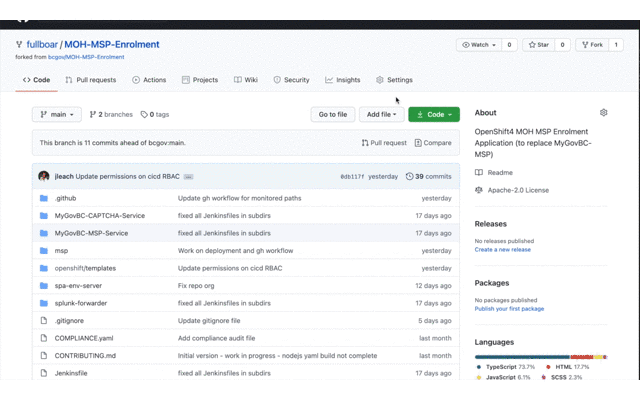
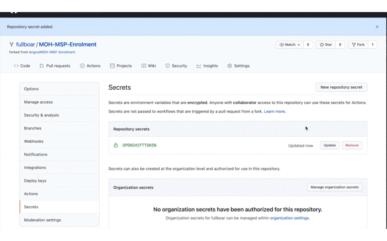

## Setup Tools

Add the Network Security Policy (NSP) to your `tools` namespace to allow any builds to access the internet; they often need to do this to pull in resources like `npm` packages:

**Make sure you're in -tools**

```console
oc process -f openshift/templates/nsp-tools.yaml \
  -p NAMESPACE=$(oc project --short) | \
  oc create -f -
```

Next, create a service account that GitHub can use to run `oc` commands on the cluster. This service account has very limited access to trigger builds, list images, and create tags:

```console
oc process -f openshift/templates/cicd.yaml \
  -p NAMESPACE=$(oc project --short) | \
  oc create -f -
```

You should see a few secrets have been created (and a service account):

```console
➜  MOH-MSP-Enrolment git:(main) ✗ oc get secrets |grep github
github-cicd-dockercfg-pn4x6   kubernetes.io/dockercfg
github-cicd-token-c74j8       kubernetes.io/service-account-token
github-cicd-token-p69fn       kubernetes.io/service-account-token
```

Use one of the tokens (any one will work) and grab the token then base64 encode it. You'll paste this info into your repository's secrets on GitHub:

```console
oc get secret/github-cicd-token-hzq6t -o json | \
  jq '.data.token' | \
  tr -d "\"" | \
  base64 -d | \
  pbcopy
```



**Pro Tip**: The command above needs `jq` installed (`brew install jq`) and assumes your on macOS; `pbcopy` just copies the output to the clipboard so you can paste it.

Next, add the OCP4 URL as another git hub secret (you can find the url when you copy the logon command):



## `spa-env-server` Build & Deployment

The following instructions are for the build and deployment of the `spa-env-server` component.

### Build

The GitHub Workflow (Actions) will use `oc` to trigger commands on-cluster. This workflow is located [here](../.github/workflows/spa-env-server.yml) in the `.github/workflows` folder of this project.

This workflow is setup to automatically run whenever files in these paths are changed:

```yaml
    paths:
      - "spa-env-server/src/**/*.js"
      - "spa-env-server/package*.json"
```

This workflow is triggerd whenever files change in these paths for a PR or direct merge to the `main` branch. The workflow has several steps to run tests, build on node 10, node 10 and the final step is to build the images on OCP. This final step in the workflow `s2i-build` **only** runs when something is merged into the `main` branch.

When the entire workflow triggers, it will create a new image and automatically tag it with `dev` to trigger an image change deployment in your `dev` namespace.

Create the OCP image `BuildConfig` using the provided OCP template:

```console
oc process -f spa-env-server/openshift/templates/build.yaml | \
  oc create -f -
```

### Deploy

The `spa-env-server` component requires several parameters be supplied to the deployment template. These can be passed in with the `-p` flat in the `oc process` command, however, its easier to supply them as key-value pairs in file and pass the file to the `oc process` command.

Sample `params-dev.txt` file:

```text
FILE_LOG_LEVEL=info
MONITOR_PASSWORD=abc123
SERVICE_AUTH_TOKEN=afvffgfg
SOURCE_IMAGE_NAMESPACE=abc123xx-tools
SOURCE_IMAGE_TAG=dev
```

Then use the argument `--param-file=params-dev.txt` to pass these environment specific values to the `oc process` command to be applied to the template:

```console
oc process -f spa-env-server/openshift/templates/deploy.yaml \
  --param-file=params-dev.txt | \
  oc create -f -
```

**Pro Tip**: Add `params-*.txt` to .gitignore to make sure sensitive prod values are never stored in a repo.

## `msp`  Build & Deployment

### Build

### Deploy
