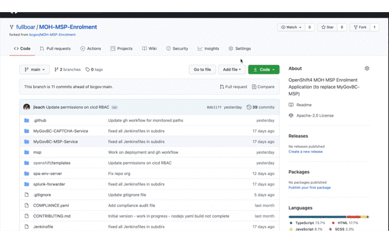

## Setup The Tools Environment

**Make sure you're in -tools**

1. Next, create a service account that GitHub can use to run `oc` commands on the cluster. This service account has very limited access to trigger builds, list images, and create tags:

```consoleoc 
oc process -f openshift/templates/cicd.yaml \
  -p NAMESPACE=$(oc project --short) | \
  oc create -f -
```

You should see a few secrets have been created (and a service account):

```console
➜  MOH-MSP-Enrolment git:(main) ✗ oc get secrets |grep github
github-cicd-dockercfg-pn4x6   kubernetes.io/dockercfg
github-cicd-token-c74j8       kubernetes.io/service-account-token
github-cicd-token-p69fn       kubernetes.io/service-account-token
```

2. Use one of the tokens (any one will work) and grab the token then base64 decode it. You'll paste this info into your repository's secrets on GitHub:

```console
oc get secret/github-cicd-token-hzq6t -o json | \
  jq '.data.token' | \
  tr -d "\"" | \
  base64 -d | \
  pbcopy
```



OPENSHIFTTOKEN

3. Next, add the OCP4 URL as another git hub secret (you can find the url when you copy the logon command):


OPENSHIFTSERVERURL: https://api.silver.devops.gov.bc.ca:6443

**Pro Tip**: 

* The command above needs `jq` installed (`brew install jq`) and assumes your on macOS; `pbcopy` just copies the output to the clipboard so you can paste it.

4. * You probably need to grant permission for the image puller to pull images from your `*-tools` namespace. The following commands will do this; update the command and run them in each each of dev, test and prod.

```console
oc policy add-role-to-user edit system:serviceaccount:f0463d-tools:default \
  -n $(oc project --short)
```

```console
oc policy add-role-to-user system:image-puller system:serviceaccount:$(oc project --short):default \
  -n f0463d-tools
```

run in dev/test/prod:
```
oc policy add-role-to-user system:image-puller system:serviceaccount:f0463d-dev:default --namespace=f0463d-tools
```

Switch back to tools

## `spa-env-server` Component

5. The following instructions are for the build and deployment of the `spa-env-server` component.

### Build

The GitHub Workflow (Actions) will use `oc` to trigger commands on-cluster. This workflow is located [here](../.github/workflows/spa-env-server.yml) in the `.github/workflows` folder of this project.

This workflow is setup to automatically run whenever files in these paths are changed:

```yaml
    paths:
      - "spa-env-server/src/**/*.js"
      - "spa-env-server/package*.json"
```

This workflow is triggered whenever files change in these paths for a PR or direct merge to the `main` branch. The workflow has several steps to run tests, build on node 10, node 10 and the final step is to build the images on OCP. This final step in the workflow `s2i-build` **only** runs when something is merged into the `main` branch.

When the entire workflow triggers, it will create a new image and automatically tag it with `dev` to trigger an image change deployment in your `dev` namespace.

Create the OCP image `BuildConfig` using the provided OCP template:

```console
oc process -f spa-env-server/openshift/templates/build.yaml | \
  oc create -f -
```
To build:

```start the build
oc start-build spa-env-server-main-build --follow
```


### Deploy

6. The `spa-env-server` component requires several parameters be supplied to the deployment template. These can be passed in with the `-p` flat in the `oc process` command, however, its easier to supply them as key-value pairs in file and pass the file to the `oc process` command.

Sample `params-dev.txt` file:

```text
FILE_LOG_LEVEL=info
MONITOR_PASSWORD=abc123
SERVICE_AUTH_TOKEN=afvffgfg
SOURCE_IMAGE_NAMESPACE=abc123xx-tools
SOURCE_IMAGE_TAG=dev
```

Then use the argument `--param-file=params-dev.txt` to pass these environment specific values to the `oc process` command to be applied to the template:

```console
oc process -f spa-env-server/openshift/templates/deploy.yaml \
  --param-file=params-dev.txt | \
  oc create -f -
```

**Pro Tip**: Add `params-*.txt` to .gitignore to make sure sensitive prod values are never stored in a repo.

## `msp` Component

7. The following instructions are for the build and deployment of the `msp` component. The build uses the on-cluster `nodejs:10` S2I image to run any scripts from `package.json` which require node. This step produces an artifacts image (msp-web-artifacts) that used as part of chained build. These artifacts are (from `npm run build`) are then consumed by the NGINX image which is pulled in from the RedHat Container Registry. This results in an image named `msp-web` that can be deployed.

The deployment mounts a `ConfigMap` containing the necessary NGINX config.

### Build

8. The GitHub Workflow (Actions) will use `oc` to trigger commands on-cluster. This workflow is located [here](../.github/workflows/msp.yml) in the `.github/workflows` folder of this project.

This workflow is setup to **automatically run** whenever files in these paths are changed:

```yaml
    paths:
      - "msp/src/**/*.html"
      - "msp/src/**/*.ts"
      - "msp/package*.json"
```

This workflow is triggered whenever files change in these paths for a PR or direct merge to the `main` branch. Also, for demonstration purposes, this workflow can be triggered manually.

The workflow has several steps to run: tests, build on node 10, node 10 and the final step is to build the images on OCP. This final step in the workflow `s2i-build` **only** runs when something is merged into the `main` branch.

When the entire workflow triggers, it will create a new image and automatically tag it with `dev` to trigger an image change deployment in the `dev` namespace.

Create the OCP image `BuildConfig` using the provided OCP template:

```console
oc process -f msp/openshift/templates/build.yaml | \
  oc create -f -
```

9. The work done on the `spa-env-server` component can be leveraged for the remanding components of this project. For example, to apply them to the `MyGovBC-MSP-Service` component the following steps will help:

1) Copy the `gulpfile.js` with the build tasks;
2) Install the packages with `npm -i -D NAME` that are located at the top of the gulpfile in the `require` lines.
3) Create a `src` directory and move required files like `index.js` into source (move any others that are needed).
4) Update the `build`, `start` and `dev` scripts in `package.json`.

At this point you should be able to run `npm run build` and have a `build` directory with the required files in it. This will be done by the node S2I image and it will look for a `build` directory for the source artifacts.

Next, create build and deploy templates for this new component:

1) Move your Jenkinsfile(s) aside they are no longer needed;
2) Copy over the `build.yaml` and `deploy.yaml` form the `spa-env-server`.
3) Update the `build.yaml` and `deploy.yaml` files as needed.

**NOTE**

In each `deploy.yaml` file there is a label `role: xxxx` this is used to identify each component in Aporeto. Its important that each deployment manifest / component get its own role so the NSP works properly.

The final step is to create a GitHub workflow:

1) Copy the file `spa-env-server.yml` in the `.github/workflows` directory to a new file representing the new component.
2) Update the paths and build names according to what you changed in `build.yaml`.
3) Consider adding a manual trigger for testing purposes.


10. Switch Apporeto to Kubernetes network policy

Make sure you're in tools:

oc get nsp
And obtain name (such as builder-to-internet), and delete it, ie:
oc delete nsp builder-to-internet

oc get en
And obtain names, then delete, ie:
oc delete en all-things-external all-things-external-builder

apply the quickstart mspweb to all (for tools, make sure your default oc project is tools):
cd /openshift/templates
oc process -f quickmspweb-toall.yaml NAMESPACE=f0463d-tools | oc apply -f -

To check things out:
The oc process should have created 3 networkpolicies and 2 network security policies.  To check them:
oc get networkPolicy
NAME                              POD-SELECTOR           AGE
allow-all-internal                <none>                 47h
allow-from-openshift-ingress      <none>                 23h
deny-by-default                   <none>                 23h
msp-service-to-splunk-forwarder   role=splunkforwarder   23h
msp-to-address-service            role=addressservice    23h
msp-to-captcha-service            role=captchaservice    23h
msp-to-msp-service                role=mspservice        23h
msp-to-spa-env-server             role=spaenv            23h
msp-to-splunk-forwarder           role=splunkforwarder   23h
oc get nsp
NAME              AGE
any-to-any        8m23s
any-to-external   47h

To look more in detail, for example:
oc describe nsp/any-to-any
oc describe networkpolicy/allow-all-internal
